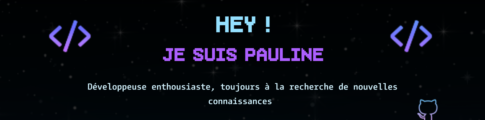
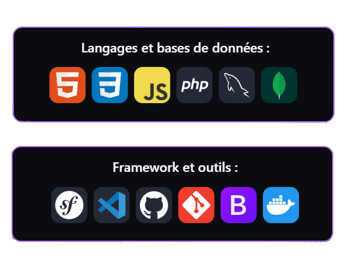
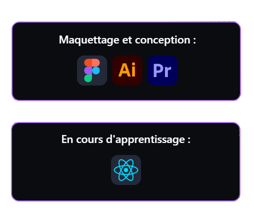
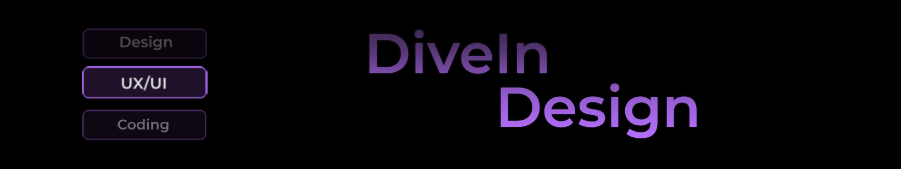
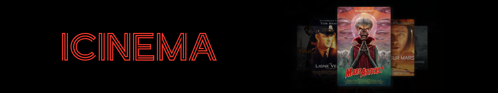

<!--

    
    

 -->

<!--| | |
|---|---|
||| -->

<table style="border: 1px solid #000000; width: 100%;">
  <tr style="border: 1px solid #000000;">
    <td style="border: 1px solid #000000; width: 45%;">
      
    </td>
    <td style="border: 1px solid #000000; width: 45%;">
      
    </td>
  </tr>
</table>

<!--

  <h3 align="center">Langages de programmation et bases de données :</h3>
  

    
  

  
  <h3 align="center">Framework et outils :</h3>
  

    
  

  
  <h3 align="center">Maquettage et conception :</h3>
  

    
  

  
  <h3 align="center">En cours d'apprentissage :</h3>
  

    
  

 
-->
<!-- 
<h3>✍️💟 Entrons en contact :</h3>

 

  

 -->

<!--
**PaulineFranck98/PaulineFranck98** is a ✨ _special_ ✨ repository because its `README.md` (this file) appears on your GitHub profile.

Here are some ideas to get you started:

- 🔭 I’m currently working on ...
- 🌱 I’m currently learning ...
- 👯 I’m looking to collaborate on ...
- 🤔 I’m looking for help with ...
- 💬 Ask me about ...
- 📫 How to reach me: ...
- 😄 Pronouns: ...
- ⚡ Fun fact: ...
-->
 

<h2 align="center">✨ Mes derniers projets</h2>

 

 

 

 

 

<!--

-->

